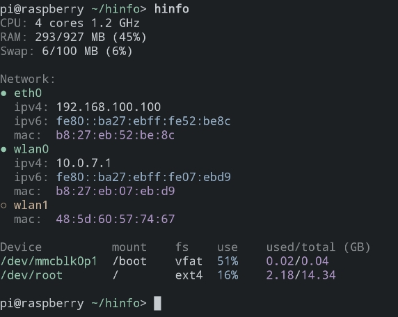

# hinfo

Display human-readable information about system

# Example



# Installation

```bash
sudo apt install python3 python3-pip
sudo -H pip3 install -r requirements.txt

# system-wide symlink (optional)
sudo ln -s $(pwd)/hinfo.py /usr/local/bin/hinfo
```

# License

MIT
